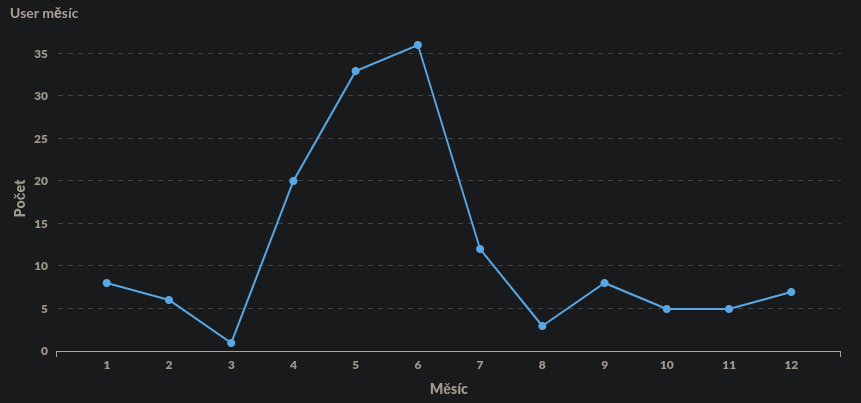

# ODM Metabase

# Obsah

1. [Návrh databáze](#návrh-databáze)
    1. [Engine](#engine)
    1. [Languages](#languages)
    1. [Books](#books)
    1. [Countries](#countries)
    1. [Authors](#authors)
    1. [Room](#room)
    1. [Users](#users)
    1. [Pickup dates](#pickup-dates)
    1. [Reservations](#reservations)
    1. [Genres](#genres)
    1. [Rating](#rating)
1. [Databázový server](#databázový-server)
1. [ODM Metabase](#odm-metabse)
1. [Ukázky](#ukázky)
    1. [Ukázka počtu rezervací na žánr](#ukázka-počtu-rezervací-na-žánr)
    1. [Ukázka počtu rezervací na měsíc](#ukázka-počtu-rezervací-na-měsíc)
    1. [Ukázka počtu rezervací na den](#ukázka-počtu-rezervací-na-den)
    1. [Ukázka délky půjčení knížky](#ukázka-délky-půjčení-knížky)
    1. [Ukázka zastoupení jazyků v knížkách](#ukázka-zastoupení-jazyků-v-knížkách)
    1. [Ukázka kdy se lidi registrují](#ukázka-kdy-se-lidi-registrují)

# Návrh databáze

Byla implementována jednoduchá databáze s využitím schématu hvězda, v rámci níž byla vytvořena tabulka rezervací ('reservations') sloužící jako hlavní tabulka


## Engine

Databázový engine této tabulky je InnoDB, což je transakční engine pro MySQL. Tento engine poskytuje řadu vlastností, jako je například podpora cizích klíčů a řízení konfliktů při přístupu k datům více uživateli současně.

## Languages

Sloupec id je typu INT UNSIGNED a slouží jako jednoznačný identifikátor pro každý záznam v tabulce. Tento sloupec je nastaven jako neprázdný (NOT NULL) a automaticky se generuje (AUTO_INCREMENT), což znamená, že hodnota v tomto sloupci se automaticky zvětšuje o 1 pro každý nový záznam.

Sloupec language je typu VARCHAR(2) a slouží k ukládání zkratky pro určitý jazyk. Například "en" pro angličtinu nebo "cs" pro češtinu. Tento sloupec je také nastaven jako neprázdný (NOT NULL), což znamená, že pro každý záznam v tabulce musí být tento sloupec vyplněn.

## Books

Sloupec id je typu BIGINT UNSIGNED a slouží jako jednoznačný identifikátor pro každou knihu v tabulce. Tento sloupec je nastaven jako neprázdný (NOT NULL) a automaticky se generuje (AUTO_INCREMENT), což znamená, že hodnota v tomto sloupci se automaticky zvětšuje o 1 pro každou novou knihu.

Sloupec languages_id je typu INT UNSIGNED a slouží k propojení s tabulkou languages. Tento sloupec je také nastaven jako neprázdný (NOT NULL), což znamená, že každá kniha v tabulce musí mít přiřazený jazyk.

Sloupec name je typu VARCHAR(45) a slouží k ukládání názvu knihy. Tento sloupec je také nastaven jako neprázdný (NOT NULL), což znamená, že pro každou knihu v tabulce musí být tento sloupec vyplněn.

Sloupec relase je typu YEAR a slouží k ukládání roku vydání knihy. Tento sloupec je také nastaven jako neprázdný (NOT NULL), což znamená, že pro každou knihu v tabulce musí být tento sloupec vyplněn.

Sloupec ISBN je typu VARCHAR(20) a slouží k ukládání ISBN kódu knihy. Tento sloupec může být nevyplněný (NULL), což znamená, že ISBN kód knihy nemusí být znám.

Sloupec pages je typu SMALLINT a slouží k ukládání počtu stran knihy. Tento sloupec je také nastaven jako neprázdný (NOT NULL), což znamená, že pro každou knihu v tabulce musí být tento sloupec vyplněn.

Hlavním klíčem (PRIMARY KEY) této tabulky je sloupec id, což znamená, že každá kniha v tabulce má jedinečnou hodnotu v tomto sloupci.

Tato tabulka také obsahuje index (INDEX), který propojuje sloupce languages_id z této tabulky a id z tabulky languages. Tento index se nazývá fk_book_languages1_idx.

Kromě toho tato tabulka obsahuje cizí klíč (FOREIGN KEY), který propojuje sloupec languages_id této tabulky s primárním klíčem id

## Countries

Sloupec id je typu INT UNSIGNED a slouží jako jednoznačný identifikátor pro každou zemi v tabulce. Tento sloupec je nastaven jako neprázdný (NOT NULL) a automaticky se generuje (AUTO_INCREMENT), což znamená, že hodnota v tomto sloupci se automaticky zvětšuje o 1 pro každou novou zemi.

Sloupec country je typu VARCHAR(20) a slouží k ukládání názvu země. Tento sloupec je také nastaven jako neprázdný (NOT NULL), což znamená, že pro každou zemi v tabulce musí být tento sloupec vyplněn.

## Authors

Sloupec id je typu BIGINT UNSIGNED a slouží jako jednoznačný identifikátor pro každého autora v tabulce. Tento sloupec je nastaven jako neprázdný (NOT NULL) a automaticky se generuje (AUTO_INCREMENT), což znamená, že hodnota v tomto sloupci se automaticky zvětšuje o 1 pro každého nového autora.

Sloupec countries_id je typu INT UNSIGNED a slouží k propojení s tabulkou countries. Tento sloupec je nastaven jako neprázdný (NOT NULL), což znamená, že každý autor v tabulce musí být přiřazen k nějaké zemi.

Sloupce f_name a l_name jsou typu VARCHAR(45) a slouží k ukládání křestního jména a příjmení autora.

Sloupec bday je typu DATE a slouží k ukládání data narození autora.

Hlavním klíčem (PRIMARY KEY) této tabulky je sloupec id, což znamená, že každý autor v tabulce má jedinečnou hodnotu v tomto sloupci.

Tato tabulka má také cizí klíč (FOREIGN KEY), který odkazuje na sloupec id v tabulce countries. To znamená, že pro každého autora v tabulce musí být přiřazena nějaká země z tabulky countries. Tento cizí klíč je pojmenován jako fk_author_countries1 a je nastaven tak, aby se při smazání nebo aktualizaci záznamu v tabulce countries nic nestalo (ON DELETE NO ACTION, ON UPDATE NO ACTION).

## Room

Hlavním klíčem (PRIMARY KEY) této tabulky je sloupec name, což znamená, že každá místnost v tabulce má jedinečný název.

Tato tabulka slouží jako seznam místností v knihovně, které mohou být využity pro různé účely, například katalogizaci knih, záznamů výpůjček a tak dále. Tabulka tedy umožňuje evidovat jednotlivé místnosti v knihovně a přiřadit jim unikátní název, což usnadňuje práci s knihovními zdroji a záznamy v databázi.

## Users

Sloupec id je typu BIGINT UNSIGNED a slouží jako primární klíč (PRIMARY KEY) pro identifikaci jednotlivých uživatelů. Sloupce f_name a l_name jsou typu VARCHAR(45) a ukládají jméno a příjmení uživatele. Sloupec username je také typu VARCHAR(45) a ukládá uživatelské jméno, které slouží k přihlašování do systému knihovny. Sloupec created je typu DATETIME a ukládá časové razítko, kdy byl uživatel zaregistrován v knihovně.

Tato tabulka umožňuje evidovat a spravovat informace o uživatelích knihovny. Umožňuje vytvářet nové uživatele a uchovávat informace o nich, jako jsou jméno, příjmení, uživatelské jméno a datum registrace. Díky tomu je možné sledovat činnosti uživatelů v knihovně, jako jsou například výpůjčky knih, vracení knih, rezervace a další aktivity. Tato tabulka je také často spojována s dalšími tabulkami v databázi, jako jsou například tabulky knih a výpůjček, aby bylo možné sledovat a spravovat aktivity jednotlivých uživatelů.

## Pickup dates

Sloupec id je typu INT a slouží jako primární klíč (PRIMARY KEY) pro identifikaci jednotlivých záznamů v tabulce. Sloupec pickup je typu DATE a ukládá datum vyzvednutí knihy.

Tato tabulka umožňuje spravovat informace o vyzvednutí knihy z knihovny. Každý záznam v tabulce reprezentuje jedno vyzvednutí, kdy uživatel vyzvedl knihu z knihovny. Sloupec id slouží k jednoznačné identifikaci každého vyzvednutí a sloupec pickup ukládá datum, kdy se vyzvednutí uskutečnilo.

Tato tabulka může být spojena s dalšími tabulkami v databázi, jako jsou například tabulky users, books a borrowings, aby bylo možné sledovat a spravovat aktivity uživatelů a knih v knihovně.

## Reservations

Tato tabulka s názvem "reservations" slouží k evidenci výpůjček knih v knihovně a obsahuje následující sloupce:

"id" - unikátní identifikátor výpůjčky, který se automaticky generuje (AUTO_INCREMENT)

"user_id" - identifikátor uživatele, který si knihu vypůjčil; hodnota musí být nenulová (NOT NULL) a kladná (UNSIGNED), a odkazuje na sloupec "id" v tabulce "users"

"pickup_dates_id" - identifikátor termínu vyzvednutí knihy; hodnota musí být nenulová (NOT NULL) a odkazuje na sloupec "id" v tabulce "pickup_dates"

"book_id" - identifikátor knihy, kterou si uživatel vypůjčil; hodnota musí být nenulová (NOT NULL) a kladná (UNSIGNED), a odkazuje na sloupec "id" v tabulce "books"

"duration_of_borow" - délka výpůjčky v dnech; hodnota musí být nenulová (NOT NULL) a kladná (UNSIGNED) SMALLINT

Tato tabulka obsahuje také tři indexy ("fk_reservation_user1_idx", "fk_reservations_pickup_dates1_idx" a "fk_reservations_book1_idx"), které slouží k optimalizaci vyhledávání a propojení s dalšími tabulkami.

Tabulka obsahuje tři omezení cizího klíče ("fk_reservation_user1", "fk_reservations_pickup_dates1" a "fk_reservations_book1"), která zajišťují, že hodnoty v sloupci "user_id" odkazují na existující řádky v tabulce "users", hodnoty v sloupci "pickup_dates_id" odkazují na existující řádky v tabulce "pickup_dates" a hodnoty v sloupci "book_id" odkazují na existující řádky v tabulce "books". Pokud by byla některá z těchto podmínek narušena (např. pokud by uživatel s určitým "user_id" neexistoval), nebylo by možné vytvořit záznam v této tabulce. Omezení jsou nastavena na ON DELETE NO ACTION a ON UPDATE NO ACTION, což znamená, že pokud by byl záznam v tabulce "users", "pickup_dates" nebo "books" smazán nebo aktualizován, nebudou se tyto změny promítnuty do záznamů v této tabulce.

## Genres

Tato tabulka s názvem "genres" slouží k evidenci žánrů knih v knihovně a obsahuje následující sloupce:

"id" - unikátní identifikátor žánru, který se automaticky generuje (AUTO_INCREMENT)

"name" - název žánru, který je textový řetězec s maximální délkou 45 znaků; hodnota musí být nenulová (NOT NULL)

Tato tabulka obsahuje také index na sloupec "id", který slouží k optimalizaci vyhledávání.

Tabulka obsahuje primární klíč "id", který zajišťuje, že každý záznam v této tabulce má unikátní identifikátor. Pokud by byl vytvořen záznam s duplicitním identifikátorem, databáze by tuto akci odmítla.

Tato tabulka umožňuje evidovat různé žánry knih, jako například sci-fi, detektivka, historický román apod. Tato tabulka může být následně propojena s tabulkou "books", aby umožnila snadnou kategorizaci knih a umožnila uživatelům vyhledávat knihy podle žánru.

## Rating

Tato tabulka s názvem "rating" slouží k ukládání hodnocení knih v knihovně a obsahuje následující sloupce:

"stars" - počet hvězdiček, které uživatel knize udělil; hodnota musí být nenulová a může nabývat hodnot od 1 do 5 (NOT NULL)

"book_id" - identifikátor knihy, kterou uživatel hodnotí; hodnota musí být nenulová (NOT NULL) a musí odkazovat na sloupec "id" v tabulce "books" jako cizí klíč (FOREIGN KEY)

"user_id" - identifikátor uživatele, který knihu hodnotí; hodnota musí být nenulová (NOT NULL) a musí odkazovat na sloupec "id" v tabulce "users" jako cizí klíč (FOREIGN KEY)

Tato tabulka obsahuje primární klíč, který se skládá z kombinace sloupců "book_id" a "user_id", což zajišťuje, že každý uživatel může knihu hodnotit pouze jednou a zároveň, že každá kniha může být hodnocena více uživateli.

Tabulka obsahuje indexy na sloupce "book_id" a "user_id", které slouží k optimalizaci vyhledávání a filtrování dat.

Tato tabulka umožňuje uživatelům hodnotit knihy v knihovně pomocí počtu hvězdiček od 1 do 5. Hodnocení může být následně použito pro generování seznamů nejoblíbenějších knih, jakož i pro doporučování knih uživatelům s podobnými zájmy.

# Databázový server

Pro účely implementace databázového řešení jsem zvážil různé možnosti, přičemž jsem se rozhodl pro MySQL. Tento výběr byl založen na mých stávajících zkušenostech s tímto systémem a též na již existujícím nasazeném serveru, díky čemuž byla instalace a konfigurace velmi usnadněna.

# ODM Metabse

Pro výběr vhodného nástroje pro řízení dat jsem pečlivě zvažoval různé varianty, včetně ClickHouse, DuckDB a dalších. Avšak žádná z těchto možností nebyla pro mou konkrétní potřebu dostačující, a to kvůli neintuitivnímu uživatelskému rozhraní a nadbytečné složitosti. Nakonec jsem se rozhodl pro Metabase, který se jeví jako flexibilní a intuitivní nástroj.

Metabase je open-source nástroj pro řízení dat, který nabízí uživatelům jednoduché rozhraní pro dotazování a vizualizaci dat z různých zdrojů. Mezi jeho klíčové vlastnosti patří například podpora různých databázových systémů, možnost tvorby vlastních vizualizací pomocí různých typů grafů a grafických prvků, a integrovaný dotazovací editor. Metabase také umožňuje uživatelům vytvářet a sdílet interaktivní dashbordy, což usnadňuje sledování klíčových ukazatelů výkonu a analýzu trendů.

# Ukázky

## Ukázka počtu rezervací na žánr

```
select count(genres.name) as "Počet", genres.name as "Žánr" from reservations inner join books on books.id = reservations.book_id inner join books_has_genres on books_has_genres.book_id = books.id inner join genres on genres.id = books_has_genres.genre_id group by genres.name order by count(genres.name) desc
```


## Ukázka počtu rezervací na měsíc

```
select count(pickup_dates.pickup) as "Počet", month(pickup_dates.pickup) as "Měsíc" from reservations inner join pickup_dates on pickup_dates.id = reservations.pickup_dates_id group by month(pickup_dates.pickup) order by count(pickup_dates.pickup)
```


## Ukázka počtu rezervací na den

```
select count(pickup_dates.pickup) as "Počet", day(pickup_dates.pickup) as "Den" from reservations inner join pickup_dates on pickup_dates.id = reservations.pickup_dates_id group by day(pickup_dates.pickup) order by day(pickup_dates.pickup)
```


## Ukázka délky půjčení knížky

```
select count(duration_of_borow) as "Počet", concat(duration_of_borow, " dní") as "Délka půjčení" from reservations group by reservations.duration_of_borow order by count(duration_of_borow) desc
```


## Ukázka zastoupení jazyků v knížkách

```
select count(languages.id) as "count", languages.language from reservations inner join books on books.id = reservations.book_id inner join languages on languages.id = books.languages_id group by languages.language order by count(languages.id) desc
```


## Ukázka kdy se lidi registrují

```
select month(users.created) as "Měsíc", count(month(users.created)) as "Počet" from reservations inner join users on reservations.user_id = users.id group by month(users.created) order by month(users.created)
```


